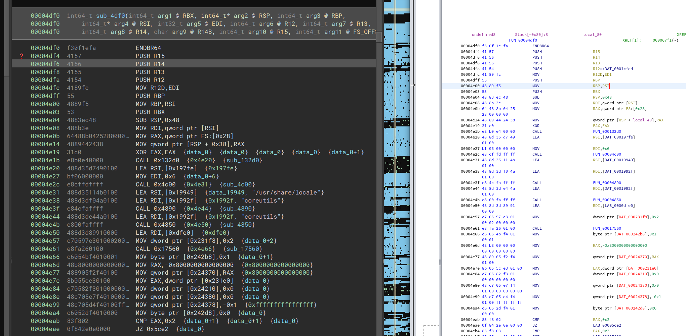
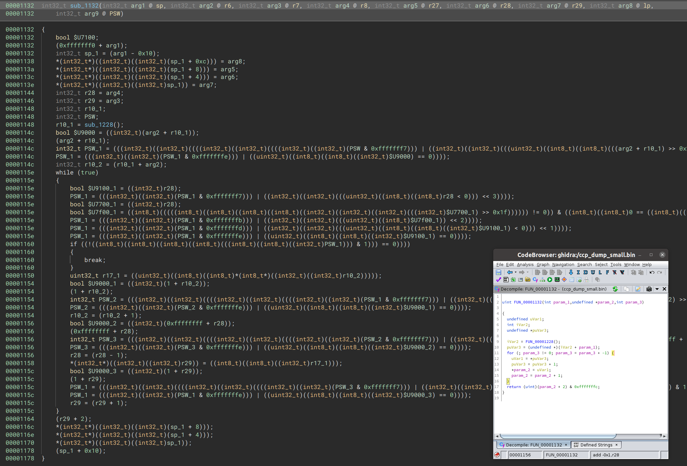

# Binary Ninja PCode
This plugin serves as a bridge between Binary Ninja and Ghidra's disassembler. This allows using all of Ghidra's supported architectures in Binary Ninja. It also makes a very poor attempt to convert p-code into Binary Ninja's Low Level IL. However, the outputted IL is very verbose and doesn't translate well into high level IL or Pseudo C.


*Comparison of disassembly between Binary Ninja and Ghidra. Architecture x86-64 - Binary: /bin/ls.*


# Compilation
```bash
mkdir build
cd build
CMAKE_PREFIX_PATH=<path to Qt6>/gcc_64/lib/cmake BN_INSTALL_DIR=<path to binary ninja> BN_API_PATH=<path to binaryninja-api> cmake ..
make -j$(nproc) install
```

# Usage
Specify an architecture to be loaded using the `LOAD_SLA` environment variable. If no architecture (or `all`) is specified all architectures wil be loaded on startup, which might take a while.

```bash
LOAD_SLA="x86-64" ~/binaryninja/binaryninja
```

# Known issues
 - The Low Level IL is very verbose and produces unusable pseudo C.
 - The plugin does not set the sleigh context specified in the .pspec. For x86-64 this is current hard-coded. If you get unexpected results like wrong instruction sizes, try setting the context for you architecture manually.
 - No support for calling conventions or special registers (e.g. `sp`, `lp`).
 - Overlapping registers are not handled. E.g. `rax` and `eax` are treated as separate registers.
 - The disassembly is not tokenized into numbers and addresses, so clicking on an address doesn't work.
 - Translation from pcode to IL is missing some instructions, and there are probably bugs


*Verbose Pseudo C output from Binary Ninja compared to Ghidra. Architecture V850 - Binary: some VW ecu dump.*

# Credits
 - [Ghidra](https://github.com/NationalSecurityAgency/ghidra) - for the enormous amount of work that went into creating and supporting all these different architectures.
 - [pypcode](https://github.com/angr/pypcode) - python library from the `angr` project to interface with pcode. Used some of their helper classes to simplify loading bytes into the pcode context.

# Supported architectures
```
6502
65c02
68020
68030
68040
6805
6809
80251
80390
8048
8051
8085
AARCH64
AARCH64_AppleSilicon
AARCH64BE
ARM4_be
ARM4_le
ARM4t_be
ARM4t_le
ARM5_be
ARM5_le
ARM5t_be
ARM5t_le
ARM6_be
ARM6_le
ARM7_be
ARM7_le
ARM8_be
ARM8_le
avr32a
avr8
avr8e
avr8eind
avr8xmega
coldfire
CP1600
CR16B
CR16C
Dalvik_Base
Dalvik_DEX_Android10
Dalvik_DEX_Android11
Dalvik_DEX_Android12
Dalvik_DEX_KitKat
Dalvik_DEX_Lollipop
Dalvik_DEX_Marshmallow
Dalvik_DEX_Nougat
Dalvik_DEX_Oreo
Dalvik_DEX_Pie
Dalvik_ODEX_KitKat
data-be-64
data-le-64
dsPIC30F
dsPIC33C
dsPIC33E
dsPIC33F
H6309
HC05
HC08
HCS08
HCS12
JVM
m8c
MCS96
mips32be
mips32le
mips32R6be
mips32R6le
mips64be
mips64le
mx51
pa-risc32be
pic12c5xx
pic16
pic16c5x
pic16f
pic17c7xx
pic18
PIC24E
PIC24F
PIC24H
ppc_32_4xx_be
ppc_32_4xx_le
ppc_32_be
ppc_32_le
ppc_32_quicciii_be
ppc_32_quicciii_le
ppc_64_be
ppc_64_isa_altivec_be
ppc_64_isa_altivec_le
ppc_64_isa_altivec_vle_be
ppc_64_isa_be
ppc_64_isa_le
ppc_64_isa_vle_be
ppc_64_le
riscv
riscv
sh-1
sh-2
sh-2a
SparcV9_32
SparcV9_64
SuperH4_be
SuperH4_le
TI_MSP430
TI_MSP430X
toy_be
toy_be_posStack
toy_builder_be
toy_builder_be_align2
toy_builder_le
toy_builder_le_align2
toy_le
toy_wsz_be
toy_wsz_le
toy64_be
toy64_be_harvard
toy64_le
tricore
V850
x86
x86-64
z180
z80
```

